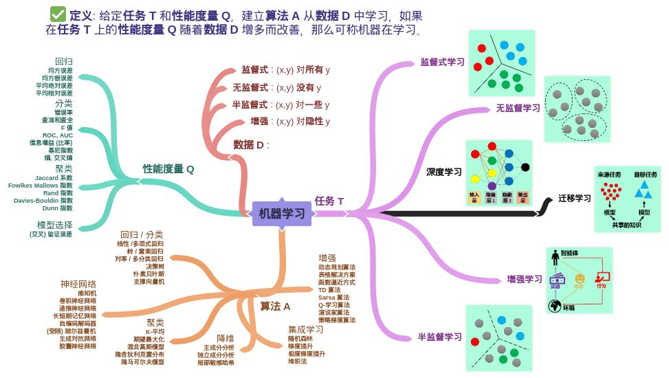
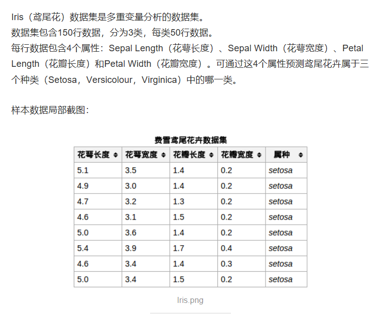
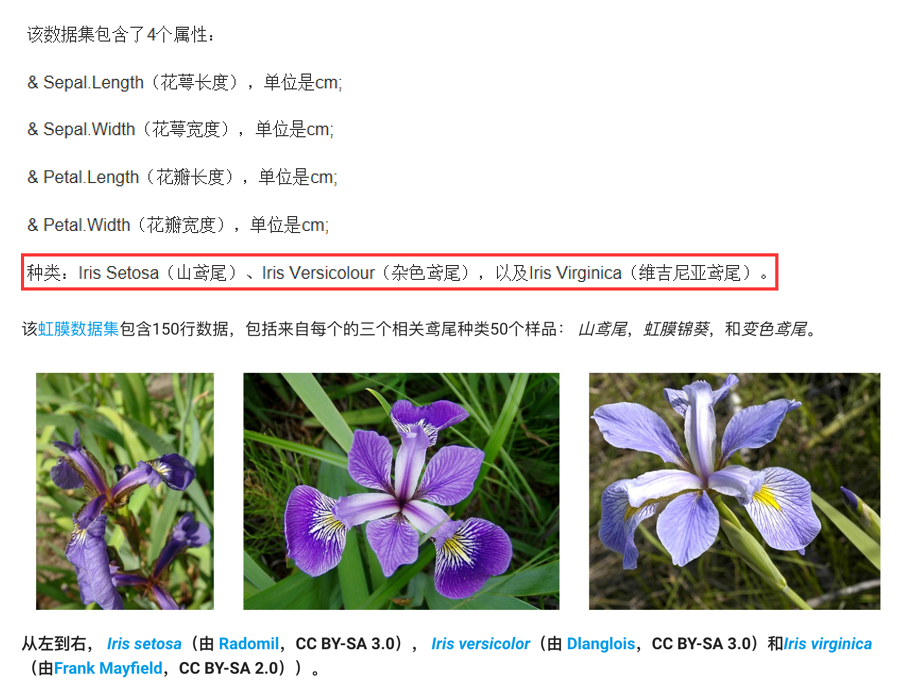

## 云诺 基于对公司业务部门的机器学习课程分享

## 远程直播间 [链接](https://k.vkaijiang.com/product/course?courseID=212854 )

## 目录

1. 人工智能（Artificial Intelligence）、机器学习 （Machine Learning） 、深度学习（Deep Learning）的关系
2. 人工智能(AI)浪潮到底取代了什么
3. AI 如何改变行业
4. 应用机器学习（ML）需要什么
5. 如何更好的利用AI、开源框架介绍
6. AI未来发展以及展望
7. 华为SoftCOM AI平台应用和介绍

## 案例
 

> * KNN算法介绍鸢尾花数据集预测
>
> * sklearn神经网络鸢尾花数据集预测（基于华为Soft AI平台）

